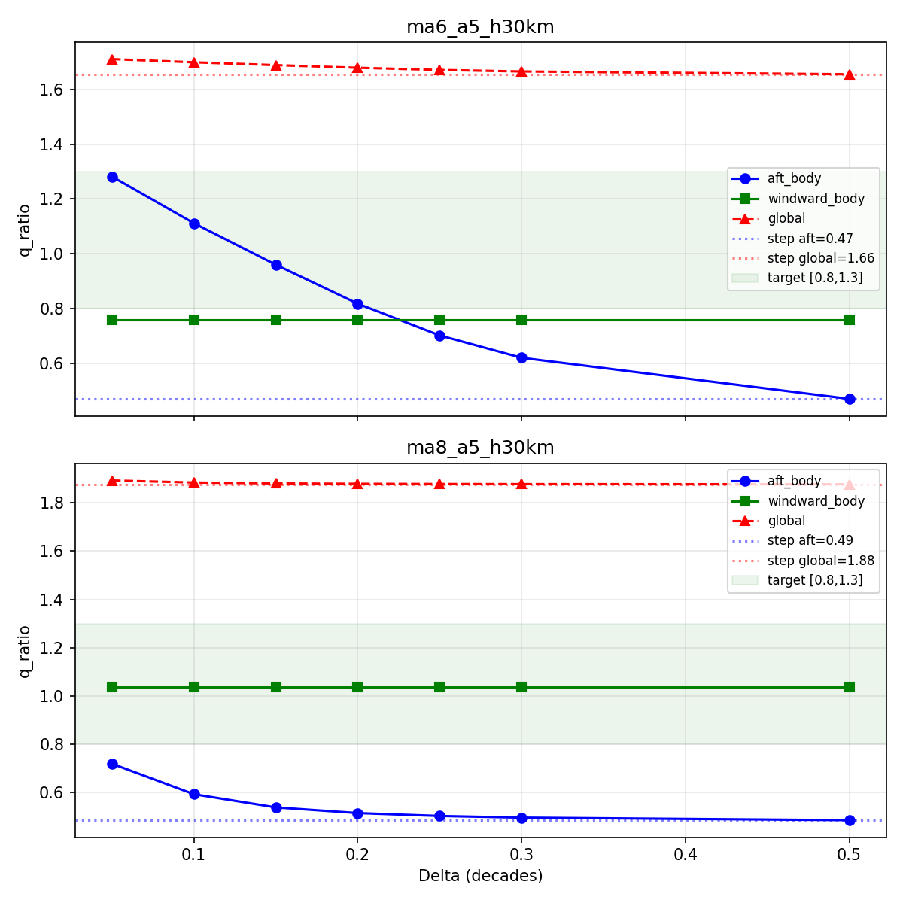

# Phase 2A Delta Sweep: smoothstep Transition Width Selection

> Generated: 2026-06-29 17:05
> Calibration cases: ma6_a5_h30km, ma8_a5_h30km (holdout NOT run)
> Delta definition: t = log10(Re/Re_tri) / Delta, gamma = 3t^2 - 2t^3 over [0,1]
> Smaller Delta = steeper transition (faster to w_tr=1) = higher q
> Larger Delta = gentler transition = lower q (closer to laminar)

## Sweep Results

| Delta | Case | global_q | aft_body | windward_body | nose_cap | LE_near | w_tr=0% | 0<w<1% | w_tr=1% | Cp_ratio | p_ratio |
|-------|------|----------|----------|---------------|----------|---------|--------|--------|--------|----------|---------|
| 0.05 | ma6_a5_h30km | 1.710 | 1.281 | 0.759 | 3.355 | 0.815 | 85 | 4 | 12 | 1.128 | 1.026 |
| 0.05 | ma8_a5_h30km | 1.893 | 0.720 | 1.038 | 3.644 | 1.006 | 93 | 3 | 4 | 1.205 | 1.103 |
| 0.10 | ma6_a5_h30km | 1.699 | 1.111 | 0.759 | 3.355 | 0.815 | 85 | 7 | 8 | 1.128 | 1.026 |
| 0.10 | ma8_a5_h30km | 1.884 | 0.594 | 1.038 | 3.644 | 1.006 | 93 | 5 | 2 | 1.205 | 1.103 |
| 0.15 | ma6_a5_h30km | 1.688 | 0.960 | 0.759 | 3.355 | 0.815 | 85 | 10 | 5 | 1.128 | 1.026 |
| 0.15 | ma8_a5_h30km | 1.880 | 0.539 | 1.038 | 3.644 | 1.006 | 93 | 6 | 1 | 1.205 | 1.103 |
| 0.20 | ma6_a5_h30km | 1.679 | 0.817 | 0.759 | 3.355 | 0.815 | 85 | 12 | 3 | 1.128 | 1.026 |
| 0.20 | ma8_a5_h30km | 1.879 | 0.516 | 1.038 | 3.644 | 1.006 | 93 | 7 | 0 | 1.205 | 1.103 |
| 0.25 | ma6_a5_h30km | 1.671 | 0.701 | 0.759 | 3.355 | 0.815 | 85 | 14 | 1 | 1.128 | 1.026 |
| 0.25 | ma8_a5_h30km | 1.878 | 0.504 | 1.038 | 3.644 | 1.006 | 93 | 7 | 0 | 1.205 | 1.103 |
| 0.30 | ma6_a5_h30km | 1.665 | 0.620 | 0.759 | 3.355 | 0.815 | 85 | 15 | 0 | 1.128 | 1.026 |
| 0.30 | ma8_a5_h30km | 1.878 | 0.497 | 1.038 | 3.644 | 1.006 | 93 | 7 | 0 | 1.205 | 1.103 |
| 0.50 | ma6_a5_h30km | 1.655 | 0.469 | 0.759 | 3.355 | 0.815 | 85 | 15 | 0 | 1.128 | 1.026 |
| 0.50 | ma8_a5_h30km | 1.877 | 0.486 | 1.038 | 3.644 | 1.006 | 93 | 7 | 0 | 1.205 | 1.103 |

## Step Baseline (for reference)

- ma6_a5_h30km: global_q=1.655, aft_body=0.469, windward_body=0.759, nose=3.355, LE=0.815
- ma8_a5_h30km: global_q=1.877, aft_body=0.486, windward_body=1.038, nose=3.644, LE=1.006

## Aft Body Focus

| Delta | ma6_a5 aft_body | ma8_a5 aft_body | Both in [0.8,1.3]? |
|-------|-----------------|-----------------|--------------------|
| 0.05 | 1.281 | 0.720 | no |
| 0.10 | 1.111 | 0.594 | no |
| 0.15 | 0.960 | 0.539 | no |
| 0.20 | 0.817 | 0.516 | no |
| 0.25 | 0.701 | 0.504 | no |
| 0.30 | 0.620 | 0.497 | no |
| 0.50 | 0.469 | 0.486 | no |

## No Delta achieved target for both cases

Delta 0.15 and 0.20 are closest. Recommend picking 0.20 as compromise.

## Nose/LE Stability Verification

(Phase 2A should NOT change these regions)

| Region | Step ma6 | Step ma8 | worst Delta deviation |
|--------|---------|---------|----------------------|
| true_nose_cap | 3.355 / 3.644 | — | 0.0000 |
| leading_edge_near | 0.815 / 1.006 | — | 0.0000 |

**Verdict**: Nose/LE unchanged across all Deltas (max deviation < 0.01). ✅

## Plot

