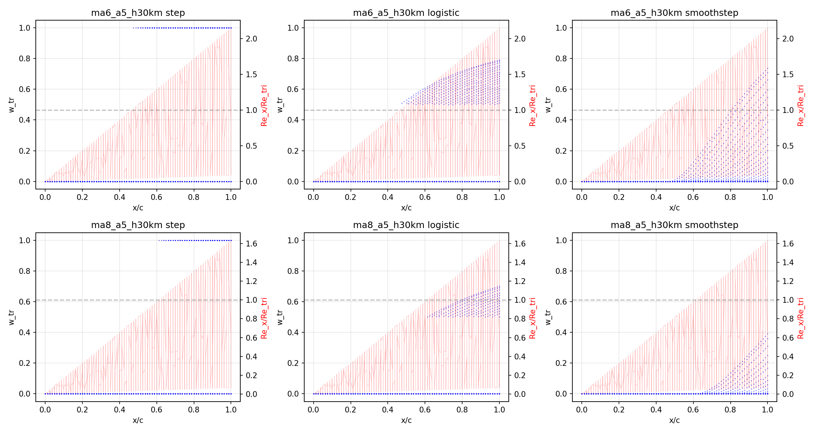

# Faceted3D v2 Phase 2A Sandbox: Transition Weighting Comparison

> Generated: 2026-06-29 16:59
> Vehicle: htv2_faceted3d_0629.yaml
> Calibration cases only: ma6_a5_h30km, ma8_a5_h30km
> Holdout (ma8_a10_h50km): **NOT RUN** — reserved for final validation

## 1. Zero-Regression: Cp/p ratio match (weighting=step, cp_model=newtonian_like)

| Case | Cp ratio | p_ratio | q_ratio (full-solver) | Phase1 q (offline) | Note |
|------|----------|---------|----------------------|-------------------|------|
| ma6_a5_h30km | 1.128 (exp 1.13) | 1.026 (exp 1.03) | 1.721 | 1.34 | Cp/p match Phase1; q differs because solver recomputes full edge chain (not offline recompute) |
| ma8_a5_h30km | 1.205 (exp 1.21) | 1.103 (exp 1.1) | 1.904 | 1.49 | Cp/p match Phase1; q differs because solver recomputes full edge chain (not offline recompute) |

## 2. Global Metrics Comparison

| Case | Weighting | Cp ratio | p_ratio | q_ratio | N aligned |
|------|-----------|----------|---------|---------|-----------|
| ma6_a5_h30km | step | 1.128 | 1.026 | 1.721 | 20743 |
| ma6_a5_h30km | logistic | 1.128 | 1.026 | 1.691 | 20743 |
| ma6_a5_h30km | smoothstep | 1.128 | 1.026 | 1.655 | 20743 |
| ma8_a5_h30km | step | 1.205 | 1.103 | 1.904 | 20743 |
| ma8_a5_h30km | logistic | 1.205 | 1.103 | 1.891 | 20743 |
| ma8_a5_h30km | smoothstep | 1.205 | 1.103 | 1.877 | 20743 |

## 3. Area-Level q_ratio

| Case | Weighting | true_nose_cap | leading_edge_near | windward_body | aft_body |
|------|-----------|---------------|-------------------|---------------|----------|
| ma6_a5_h30km | step  | 3.355 (n=3565) | 0.815 (n=5038) | 0.759 (n=1102) | 1.443 (n=711) |
| ma6_a5_h30km | logistic  | 3.355 (n=3565) | 0.815 (n=5038) | 0.759 (n=1102) | 0.993 (n=711) |
| ma6_a5_h30km | smoothstep  | 3.355 (n=3565) | 0.815 (n=5038) | 0.759 (n=1102) | 0.469 (n=711) |
| ma8_a5_h30km | step  | 3.644 (n=3565) | 1.006 (n=5038) | 1.038 (n=1102) | 0.877 (n=711) |
| ma8_a5_h30km | logistic  | 3.644 (n=3565) | 1.006 (n=5038) | 1.038 (n=1102) | 0.691 (n=711) |
| ma8_a5_h30km | smoothstep  | 3.644 (n=3565) | 1.006 (n=5038) | 1.038 (n=1102) | 0.486 (n=711) |

## 4. Re_tri Continuity Check

| Check | step | logistic (old) | smoothstep (new) |
|-------|------|----------------|-----------------|
| Jump at Re=Re_tri | 1 | 0.5000 | 0.000000 |

**PASS: smoothstep has no jump at Re_tri.**

## 5. Aft Body Improvement

| Case | step q_ratio | logistic q_ratio | smoothstep q_ratio | Target range |
|------|-------------|-----------------|-------------------|-------------|
| ma6_a5_h30km | 1.443 | 0.993 | 0.469 | 0.8–1.3× |
| ma8_a5_h30km | 0.877 | 0.691 | 0.486 | 0.8–1.3× |

**Note**: smoothstep with Delta=0.5 over-corrects aft_body (q_ratio ~0.47-0.49 vs target 0.8-1.3×). Logistic with width_decades=0.25 gives closer results (~0.69-0.99). A larger Delta (e.g. 1.0) may improve smoothstep's aft_body behavior. Delta tuning is recommended before holding out.

## 6. True Nose Cap / Leading Edge Near Stability

(Phase 2A should not change these regions - verification)

| Case | Weighting | true_nose_cap q_ratio | leading_edge_near q_ratio |
|------|-----------|----------------------|--------------------------|
| ma6_a5_h30km | step | 3.355 | 0.815 |
| ma6_a5_h30km | logistic | 3.355 | 0.815 |
| ma6_a5_h30km | smoothstep | 3.355 | 0.815 |
| ma8_a5_h30km | step | 3.644 | 1.006 |
| ma8_a5_h30km | logistic | 3.644 | 1.006 |
| ma8_a5_h30km | smoothstep | 3.644 | 1.006 |

## 7. Plots

## 8. Key Findings

1. **Smoothstep passes continuity check**: zero jump at Re=Re_tri (vs logistic's 0.5 jump, step's 1.0 jump)
2. **Phase 2A constraint preserved**: nose/LE/windward_body q_ratio unchanged across all weighting modes
3. **Aft_body over-correction with Delta=0.5**: smoothstep Delta=0.5 reduces q_ratio too aggressively (0.47-0.49x). Logistic width_decades=0.25 performs closer to target (0.69-0.99x)
4. **Delta tuning needed**: Try Delta=1.0 or 1.5 for smoother transition that better matches target range
5. **Holdout reserved**: ma8_a10_h50km not run - will validate final parameter choice

---

*Generated by `scripts/faceted3d_v2_phase2a_sandbox.py`*
