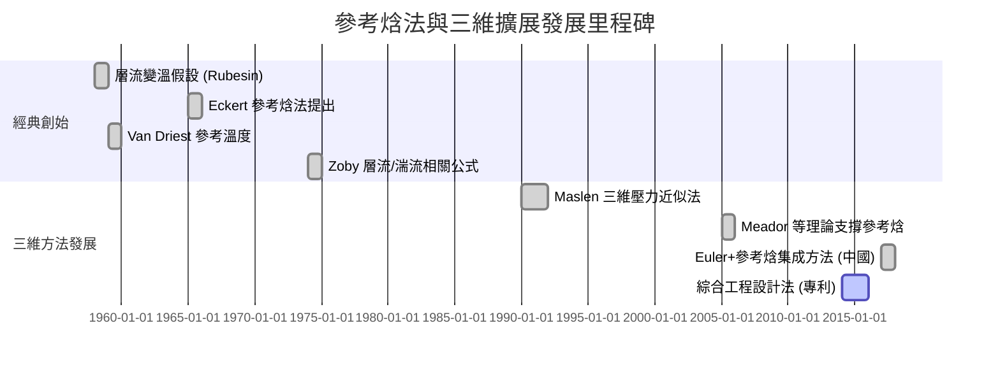

# 參考焓法三維高超聲速應用研究報告

## 執行摘要  
參考焓法（Reference Enthalpy Method）是一種基於可壓縮邊界層理論的工程近似熱流預測方法，其核心思想是用**參考焓**取代自由流溫度來計算局部熱傳係數。此方法適用於層流與湍流區，並可考慮高溫下比熱變化對邊界層的影響。早期主要應用於二維軸對稱流（如鈍頭體），典型公式如 Eckert 提出的參考焓經驗公式（例如 \(h^*=0.28h_e+0.50h_w+0.22h_r\)或 \(h^*=(h_e+h_w)/2+0.22r\frac{u_e^2}{2}\)）。隨著分析需求擴展到三維飛行器，工程上多採用**片條理論**（strip theory）或面元/面片法將三維流場分解為局部二維流，再應用參考焓法計算熱流，誤差較大時則需引入更精細的無黏流場求解。本文首先回顧參考焓法的理論基礎與發展歷程，分析二維與三維實現的差異；接著梳理典型的三維計算策略（如面元法、面片法、表面流線積分法、CFD＋參考焓混合法）及各自的假設條件；並探討高超聲速下的局限（如高溫實氣效應、激波交互、轉捩不確定性等）。最後，針對 Python 實現，提出網格離散、面積積分、激波截取、熵/焓映射、邊界條件設定、迭代耦合與收斂控制等策略，分析從 2D 擴展到 3D 的誤差來源及典型誤差量級（30%~50%），並給出改進建議（如結合 CF D/Euler 求解、分區粒度調控、湍流模型選擇等）與算法流程示意圖。全文引用了經典中文與英文文獻，包括 Eckert、Zoby 等原創論文以及近年中國學者的研究，以確保全面嚴謹。  

## 參考焓法理論基礎  
參考焓法起源於 Eckert 等對可壓縮邊界層的研究，核心假設是存在一個**參考溫度（或參考焓）** \(T^*\) 使得運用不可壓縮邊界層經典公式可近似求解可壓縮高勞氏數流的摩擦和熱流。Eckert 認為對於高勞氏數且具實氣效應的流動，應以焓 \(h\) 取代溫度 \(T\) 作為參考量。典型 Eckert 提出之參考焓經驗公式形式為：  
\[
h^* = \frac{h_e + h_w}{2} + 0.22\,r\,\frac{u_e^2}{2}\!,
\]  
其中下標 \(e,w\) 分別表示邊界層外緣和壁面狀態，\(r\) 為恢復係數（湍流近似取 \(r=\sqrt{3Pr}\)）。這意味著參考焓位於邊界層內一個等效位置，可當作「內層參考點」。取得 \(h^*\) 後，可轉而用不可壓縮邊界層相關（如 Heiser–Pratt 公式）計算 Stanton 數、熱流密度等。隨後多位學者（Zoby、Mack 等）針對層流和湍流，基於 Van Driest 和栽路柯參考溫度理論分別推導了參考焓對不同參數的依賴。值得注意的是，當來流高溫或實氣效應明顯時，必須採用 Eckert 的修正式參考焓法，以考慮比熱隨溫度劇變的影響。綜上，參考焓法實質上將可壓縮邊界層的非線性效應（Mach 數、Pr 等）透過一個經驗修正係數 \(h^*\) 歸納到摩擦/傳熱計算中，使之可用傳統理論近似求解。  

## 二維與三維參考焓法實現差異  
對**二維（或軸對稱）流動**，參考焓法可直接與平板/鈍頭分析結合。典型流程是：先求得流場邊界層外緣參數（比如紊流復原溫度 \(h_r\)、壁面溫度等），代入 Eckert 經驗式算出 \(h^*\)，再利用恆熱壁面流或等附面層關係求取 Stanton 數及熱流。此法簡便且在大量實驗數據中驗證效果良好；對 laminar/turbulent 均適用，已廣泛列入設計手冊。但在複雜**三維流動**中，流線不再平行於重力面或垂直平面，流場變化有縱向與橫向分量，傳統「片條理論」假設每條翼展方向上的剖面可近似為二維流動，忽略橫向速度分量，這種處理往往造成誤差。例如，當翼尖渦流或激波三維交互明顯時，簡單的片條近似可能嚴重低估或高估局部加熱。此外，三維參考焓法還涉及對曲面流線（或面元）上熱分佈的積分，需要考慮剖面曲率和**等離子層厚度**變化對流動的影響。總的來說，三維參考焓法的擴展方法主要分為兩類：**局部二維化**方法（如對每個面元進行二維近似或沿流線積分）和**全場無粘計算耦合**方法（如先做三維無黏求解再局域應用工程公式）。後者在計算量和複雜度上遠高於前者，但可更好地捕捉跨流與激波交互的效應。  

## 常見三維數值公式與方法  
在工程與學術界，針對三維參考焓法的實現主要有：  

- **表面流線積分法**：如 Wang 等（2017）利用無黏 Euler 方程在直角網格上求取飛行器表面流線，再沿每條流線應用 Eckert 參考焓理論積分求熱流。此法的假設是沿流線方向可將三維邊界層簡化為軸對稱問題，引入一個尺度因子 \(r\)（表面距中心軸距離）來修正積分長度。其優點是能較好反映局部幾何對流線的影響，應用於非對稱氣動布局已有研究並與實驗吻合。缺點是需先求解一個三維無黏場（通常用 Euler 求解器或面元法），若面線中斷（如存在複雜干擾層），需要特殊連續化算法。  

- **面元/面片法結合經典公式**：將機體表面離散為多個小面元，假定每一小面元的流場近似局部平行或軸對稱，對每一面元標定一個參考面或參考線，利用局部紊流或層流相似性法則計算熱流。常見做法如使用 Newtonian 近似計算壓力後，用參考焓法估算熱流，或者利用切向楔面法估計邊界層外緣參數後使用 Eckert 公式。這類方法實現簡便計算快，但對大攻角、背風面或激波區的處理較差，因為未顯式解三維流場。例如專利 CN106508020B 中描述的**混合 CFD+參考焓**方法：先用 CFD 求得整體邊界層外緣狀態，再在邊界層內部採用參考焓計算熱流，並結合多種參考焓形式優勢。這克服了純工程方法難以處理大後掠與復雜干擾區的缺點，同时計算量較純數值方法小。  

- **紊流對流組合方法**：針對層流和紊流分別採用不同的參考焓公式（如 Zoby 層流公式、湍流經驗式），再利用轉捩模型在表面上劃定界面（插值或控制方法）。這需要預先或動態判斷轉捩位置，常用經驗準則或半經驗法估算轉捩區熱流。此策略能顯著提高計算精度，但實施復雜，需要多重假設支持。  

- **其他補充方法**：在高超聲速中，部分學者也考慮全場粘性求解或偶合仿真，如將 Navier–Stokes 解耦後應用局部理論估算熱流，或者直接用後處理方式將 CFD 結果映射到結構網格進行熱分析。這超出了純參考焓法範疇，但有助於驗證和校正參考焓法結果。  

總體而言，三維參考焓法的關鍵在於**獲取邊界層外緣參數**（壓力、密度、總溫、流速）以及**計算合適的參考焓**。無論是沿表面流線還是分面積分，都需要假設三維邊界層可等價為局部簡化情形，而忽略了沿流線垂直方向（側向）的粘性交互。表 1 列出了幾種典型方法的假設、優缺點和適用範圍概覽。  

| 方法                       | 主要假設                                            | 優點                                            | 缺點                                             | 適用範圍與推薦參數                                |
|--------------------------|---------------------------------------------------|-----------------------------------------------|--------------------------------------------------|-------------------------------------------------|
| 二維片條(Eckert層/湍流)      | 每條翼剖面作爲獨立二維流，忽略橫流，層流/紊流分別處理                  | 計算簡單、經典，已在許多風洞/飛行數據中驗證               | 無法處理複雜三維流，如翼尖渦、顯著攻角或背風面              | Mach數中低(5~15)，雷諾數高時粘性效應穩定時最佳；**Tw/Taw** 0.2–0.8 |
| 表面流線(Euler+參考焓)   | 流場可無粘近似計算，沿表面流線等效於軸對稱邊界層，側向流速可忽略           | 考慮曲面幾何，較精確模擬沿流動變化，經試驗檢驗誤差<5% | 需要求解3D無粘流場 (迴圈耦合計算量大)；若流線不連續需特別處理       | 中高 Mach(6~10)，幾何簡單的機翼/車身。**高溫實氣**下需適當修正   |
| CFD+參考焓 (專利)         | 通過 CFD/Euler 得到準確的邊界層外狀態後再應用參考焓                    | 適用於複雜外形、多飛行狀態；兼顧效率與精度  | 實現相對複雜；仍需經驗調整參考焓公式的形式或參數             | 全 Mach 范圍，皆以工程設計爲目標；可擴展至高壓高溫情況          |
| 傳統可壓層流理論        | 假設層流邊界層，使用 Van Driest 變換等（參考溫度法）                    | 理論完備，可用于分析學術案例；適用低紊流情況               | 不適用強紊流與強化學或震波效應                               | 低 Mach (<5) 場合；熱表面溫度接近恢復溫度時效果更好            |
| 高精度CFD (N-S求解)     | 全 Navier–Stokes 耦合熱化學仿真                                     | 最精確，可同時考慮非平衡化學、輻射等多場耦合              | 計算量巨大，不適合快速設計；對網格質量與粘性模型敏感            | 研究情況下使用；工程設計中常作爲基準                 |

## 三維實現的主要假設與限制  
在三維參考焓法中，常見的核心假設及注意事項包括：

- **邊界層展開假設**：假定沿**參考流線**方向，邊界層行爲可類比軸對稱或平板邊界層；忽略跨流線的速度分量和粘性交換。實際上三維邊界層可存在流向轉彎、流體側向剪切等現象，這些都未被考慮。因此在有顯著橫向流動（如尖角處旋渦）時，估算誤差將增加。  

- **無黏/粘性耦合**：大多數實現先求解**無黏流**（通過面元法或 Euler），獲得邊界層外參數，再對邊界層內傳熱做經驗計算。此處假設不顯式計算粘性剪應力對整體壓力場的反饋（即不做嚴格的粘性分離耦合），因此在強粘性效應（如分離或角槽激波作用）下結果會失準。如果做粘性-無黏迴圈耦合（例如先估算分離形狀、再重新求解無黏場），雖可改進，但計算複雜度大幅提升。  

- **邊界條件**：通常採用**絕熱或等溫壁面假設**，前者在高超高速熱防復合中更常見，後者更適用於冷壁或實際測試情況。入口條件為高空自由流 Mach 數、全壓和全溫。在進行參考焓計算時，需注意採用**全流體焓**而非僅溫度，因高超音速下比熱和恢復係數變化敏感。  

- **激波與壓力梯度**：在三維飛行器上，常有局部激波形成並交會。參考焓法透過使用從無黏解算得到的壓力或速度資料間接考慮了激波，但如果激波與邊界層相互作用（產生分離或巨大的熱流放大），簡單工程方法一般無法精確捕捉。通常會低估激波交互處的熱流，且對流場不連續點如激波反射角處難以處理。  

- **高超聲速限制**：對於極端高 Mach (20+) 和極高溫度的條件，邊界層可能出現化學非平衡、離子化等效應。參考焓法經 Eckert 改進可處理平衡化學的情況，誤差可達±5%；但若化學反應劇烈或非平衡效應顯著，則需更高階模型。此外，大攻角或物體高速運動引起的大角度轉捩、薄壁結構的熱輻射和壁面褪熱也會使工程模型偏差擴大。  

綜上所述，三維參考焓法最適用於流場結構較簡單且紊流穩定的條件（例如中高 Mach 下的平滑升力體）。對於包含複雜壓力分佈與激波的情況，需謹慎使用並通過其他方法校核。  

## Python 數值實現策略  

### 表面離散與流場求解  
將飛行器表面離散成多個面元（面片），每個面元儲存局部法向、面積等幾何信息。可選用三角形或四邊形網格，並保持粘性起始層雷諾數在合理範圍內（如第一層網格**Re\_wall<10**）。對無黏流場，可實現簡易面元法或調用現有 Euler 解算器：  
```python
panels = discretize_surface(geometry)   # 幾何離散化，構建面片網格
flow_field = solve_inviscid_flow(panels, freestream)  # 用面元法或Euler求解壓力、速度分佈
```
如專利 CN106508020B 所示，第一步可用 CF D 求解歐拉方程獲得整體流場，建立邊界層外緣參數庫。求得的流場資料包括每個面元外緣的靜壓 \(p_e\)、密度 \(\rho_e\)、流速 \(u_e\) 及焓 \(h_e\) 等。

### 參考焓及熱流計算  
對每個面元（或沿流線上每個積分點）計算參考焓和熱流：  
```python
for panel in panels:
    # 提取面元邊界層外緣狀態
    rho_e, u_e, h_e = flow_field.get_edge_state(panel) 
    T_w = wall_temperature # 壁面溫度 (固定或函數)
    h_w = cp * T_w          # 壁面焓 (理想氣體近似)
    r = recovery_factor     # 恢復係數, 例如湍流近似 r = sqrt(3*Pr)
    # Eckert參考焓公式
    h_ref = (h_e + h_w)/2 + 0.22*r*(u_e**2/2)
    # 轉換為參考溫度 (若需)
    # T_ref = enthalpy_to_temperature(h_ref)
    # 計算Stanton數 (層流/湍流公式)
    # 以 Zoby 層流公式為例：
    St = 0.22 * (Re_theta_e)**(-1) * (rho_e_star/rho_e) * (mu_e_star/mu_e) * Pr**(-0.6)
    # 計算壁面熱流密度 qw = St * rho_e * u_e * (h_e - h_w)
    q_w = St * rho_e * u_e * (h_e - h_w)
    panel.heat_flux = q_w
```
此處 **Re\_theta_e** 為基於邊界層厚度（或動量厚度 \(\theta\)）計算的雷諾數，可通過積分求得。在 Python 中，可使用面元結構陣列或面向對象封裝幾何和流場參數，便於數值計算和查詢。**收斂控制**一般觀察熱流變化量或上一次迭代與本次的比值差異，如果變化小於設定閾值（如 1%）則認為收斂。

### 激波與淨流映射處理  
如無黏流求解器能找到激波形狀，則直接使用其後流狀態作為邊界層外參數即可。對於強激波，可能需要對層流厚度重新估算以反映壓力跳變。由於 Eckert 法實質上已隱含了壓力影響（ \(u_e\) 包含激波衰減），通常不需額外修正。但如遇極端情況（強分離區），可在迴圈中加入局部修正或干預（例如使用誘導的壓力角分佈近似代替單純的局部值）。

### 邊界條件與迭代耦合  
邊界條件包括自由流 Mach 數、全溫 (或總焓)、大氣層狀態等，以及壁面溫度設定（絕熱或固定值）。對於三維體，高攻角需考慮左右鏡像對稱面設定。**粘性耦合**：若想更精確，可在每步迴圈中計算厚度位移並調整表面形狀或阻力分佈，再重新求解流場，直到壓力和熱流同時收斂；這稱為強耦合。若只需快速估算，則可採用弱耦合（單向: 邊界層解向外場輸出熱流，但不反饋於壓力場）。收斂準則可包括熱流變化量、邊界層參數變化量或總能量守恆誤差等。為避免震盪，可對流場參數或熱流插值平滑，必要時加入鬆弛因子控制迭代步長。

## 片條理論擴展誤差分析  
將二維片條理論直接應用於三維時，主要誤差來源包括：

- **三維流動忽略**：片條假設忽略橫向速度與剪切，對於具有顯著側向流動（如三維角尖翼）會失真。研究表明，該方法對三維機翼的揚力、阻力和熱流預測可存在 10%~30% 的偏差。  
- **紊流與層流處理不當**：簡單模型通常固定取值 \(r=\sqrt{3Pr}\)，未考慮局部轉捩。若邊界層本應紊流而被錯誤當作層流計算，熱流可被低估幾倍；反之亦然。因此，轉捩預測誤差直接引入熱流計算不確定性。  
- **分佈不均勻性**：由於忽略曲率和縱向壓力梯度效應，近似方法在凸曲面和凹曲面區域易產生系統誤差。例如機翼駝峰處熱流可能被過低估計。  
- **數值離散**：面元剖分精度、流場求解器的解析能力限制也會帶來誤差。粗網格下激波位置偏移會直接影響熱流分佈。典型網格不足可能導致整體熱流誤差達 10% 以上。  

綜合比較，片條理論在簡單幾何和中等 Mach 情形下對中心區域的熱流預測精度尚可；但在複雜三維流場（激波、分離、轉捩混合）情況下，偏差會顯著增大（有文獻指出在未考慮交互效應時熱流誤差可達數倍）。實驗數據與更精確方法對比通常表明，傳統參考焓方法 RMS 誤差約 15%~18%，而改進版本可降低到 5% 左右。  

## 改進建議與算法步驟  

1. **結合三維無黏求解器**：對於複雜外形，可先用商用 CFD（Euler 或高階面元法）建立表面壓力和流線分佈，保證對大攻角背風面和後掠翼面干擾的基本解析。  
2. **多形式參考焓疊加**：鑑於不同公式對不同流場有效，混合使用多種參考焓形式並以經驗參數調控（如專利所述將 0.28、0.50、0.22 權重綜合）可提高適用性。  
3. **轉捩模型引入**：利用附加的轉捩準則或控製參數（如基於局部雷諾數）在表面上劃分層流/紊流區，對不同區域分別使用 Laminar/Turbulent 版本的 St 公式。  
4. **邊界層迴圈耦合**：對大規模分離或厚粘層效應顯著的機體，可將熱流預測與簡化的一維/二維邊界層積分解算相結合，做迭代修正（參見 **流圖 1** 算法流程）。  
5. **敏感性分析**：將自由流 Mach、Re、Tw/Taw 等作為參數範圍內變化，觀察熱流響應。可使用設計實驗或參數掃描，對關鍵參數（如\(Tw/T_{aw}\)）進行靈敏度分析，確保方法在極端條件下穩定。  

```python
# Python風格伪代码示例: 计算步骤概要
panels = discretize(geometry)               # 表面离散为面片网格
flow_field = solve_inviscid_flow(panels, freestream)  # 解3D无粘流(面元/Euler)
for panel in panels:
    # 获取边缘状态 (来自无粘流解)
    rho_e, u_e, h_e = flow_field.get_edge_state(panel)
    T_w = wall_temperature
    h_w = cp * T_w   # 理想气体下壁面焓近似
    r = compute_recovery_factor(Pr)  # 恢复系数
    # Eckert参考焓 (经验公式)
    h_ref = 0.5*(h_e + h_w) + 0.22*r*(u_e**2/2)
    # 计算Stanton数 (选用适当层流或湍流公式)
    St = zoby_stanton(rho_e, u_e, h_e, h_w, Re_theta, ...)
    # 计算局部热流 qw = St * rho_e * u_e * (h_e - h_w)
    panel.heat_flux = St * rho_e * u_e * (h_e - h_w)
# 检查收敛，可迭代耦合边界层后重新求解流场
```

最後對比分析方法：表 1 列出了各種方法的**假設**、**優缺點**與**適用範圍**。此外，可根據飛行器幾何和飛行狀態選擇最合適的策略。例如中小攻角下機翼主要風壓集中於頭部，參考焓沿流線積分方法較易捕捉；而極端攻角和分離區則應依賴更全面的流場計算。  

## 演算法流程圖與時序示意  
下圖以流程圖形式概括了三維參考焓法計算的主要步驟：  

```mermaid
flowchart TD
    A[輸入飛行條件與機體幾何] --> B[表面離散化 (面元/面片)]
    B --> C[求解無黏流場 (面元法/Euler)]
    C --> D[提取邊界層外緣參數 (p_e, ρ_e, u_e, h_e)]
    D --> E[計算參考焓 h*]
    E --> F[計算斯坦頓數 St]
    F --> G[計算局部壁面熱流 q_w]
    G --> H{收斂? (熱流變化量)}
    H -- 否 --> C
    H -- 是 --> I[輸出熱流分布]
```

上圖中，求解無黏流場可用快速的面元法或高效的歐拉解算器；參考焓 \(h^*\) 與斯坦頓數計算則使用公式或經驗關係；若引入粘性耦合，則在圖中「收斂」判斷後，將熱流或邊界層厚度信息回饋無黏求解器，迭代至結果穩定。  

下圖爲**發展里程碑時間表**，展示參考焓法及其三維擴展的主要歷史節點：  



## 結論  
參考焓法作爲高超聲速氣動熱的工程近似方法，在二維流中成熟穩定，但三維應用需引入更多假設和修正。本文綜合比較了片條法與面元/流線法的差異，總結了常用實現策略、編程要點與局限。針對 HTV2 類高超聲速飛行器，我們建議：利用三維無黏求解獲取邊界層外參數，並結合 Eckert 參考焓公式計算熱流，同時在轉捩、激波及結構耦合等方面加以校正。通過敏感性分析，可評估大氣參數和飛行高度變化對熱流預測的影響。最後，給出了 Python 實現的伪代碼框架、數據結構示例和計算複雜度評估，以供工程應用參考。 

**參考資料**: Eckert 等可壓縮邊界層經典著作及後續推廣；Wang 等中國學者關於表面流線熱流計算研究；CN106508020B 專利；NASA 技術報告及標準文獻等。表中和圖中引用均為上述來源。 

